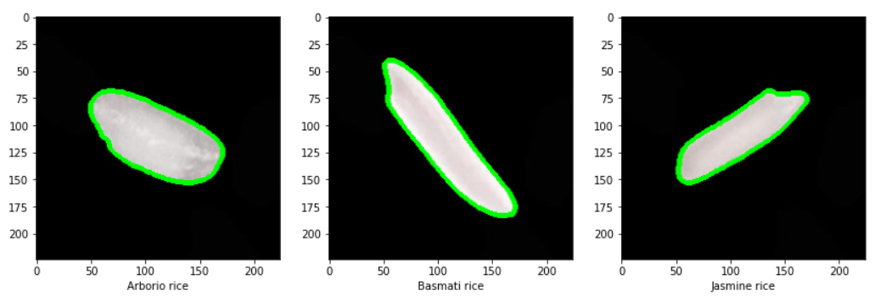

# Identification of Rice Varieties using ML algorithms : Project Overview
This project was part of the TKO_3120 Machine Learning and Pattern Recognition course at the Universiy of Turku

## Introduction
Rice (Oryza sativa L.) has supported a greater number of people for a longer period of time than any other crop since it was domesticated between 8,000 to 10,000 years ago (Greenland, 1997). At present, rice is the staple food for more people than wheat, and 90 percent of total rice production is grown and consumed in Asia (Evans, 1998). As such, accurate classification of different varieties of rice is crucial for optimizing agricultural practices, improving crop management, and ensuring food safety.
Machine learning algorithms can play a crucial role in automating the identification of rice varieties, which can be a time-consuming and labor-intensive task for human experts. By leveraging advanced algorithms and techniques for data analysis, machine learning can help to identify patterns and extract features from large datasets of rice images, which can then be used to classify different varieties of rice.
During the different stages of this project we were able to gather and analyze 300 sampled images of three different varieties of rice, "Arborio", "Basmati" and "Jasmine", which were collected by the research group in the department of Computer Engineering, in Selcuk University. The images were preprocessed and feature-extracted using a combination of color and dimension features. The new data was then used to perform a preliminary data analysis and exploration to try and find hidden clues and patterns in the data to help guide the modeling step.
Several machine learning algorithms were trained and tested on the dataset, including k-nearest neighbors (KNN), Random Forest (RF), and Multilayer perceptron (MLP). The performance of each algorithm was evaluated using nested cross validation, using 10-fold cross validation for outer loop and 5-fold repeated cross validation with 3 repetitions for inner loop. Eventually, we also calculated the accuracy and the confusion matrix for each model to better judge the model performance.
The results showed that the Random Forest algorithm achieved the highest accuracy of 98,67% in classifying different rice species, followed by KNN with an accuracy of 98,33%. Final notes and conclusions demonstrated the potential of machine learning algorithms in automating the identification of rice species, which can have significant implications for improving agricultural practices and ensuring food safety.

The original work for this study can be found in the following research article : İ. Çınar and M. Koklu. Identification of rice varieties using machine learning algorithms. Journal of Agricultural Sciences, 28(2):307–325, 2022. doi: 10.15832/ankutbd.862482.

## Dataset 
- the Dataset can be found from (click the link to download) https://www.muratkoklu.com/datasets/vtdhnd09.php
- For reproduction purposes save the data folders "Arborio", "Basmati" and "Jasmine" in "data" folder
- We used a random sample of 100 images from Arborio, Basmati and Jasmine rice species (i.e. 300 images in total)

## [Part 1 : Data Preparation](Part1.ipynb)
After succesfully importing the data and determining the contour of each rice specie, the next step was to try and gether the feature data, this includes the following variables:
- Color features (including only the pixels within the contour)  

    - Mean for each RGB color channel 
    - Variance for each RGB color channel 
    - Skewness for each RGB color channel 
    - Kurtosis for each RGB color channel 
    - Entropy for each RGB color channel 
    
- Dimension features (after fitting an ellipse to the contour points)  

    - the major axis length the ellipse 
    - the minor axis length of the ellipse 
    - area inside the contour 
    - perimeter of the contour 
    - roundness 
    - aspect ratio
      
## [Part 2 : Data exploration and Model Selection](Part2.ipynb)

- Data Exploration : After getting the data ready, the next step was to perform some EDA to get a deeper look into the data, this have included the following :

  - Standardizing the data
  - Ploting a boxplot of each feature
  - Ploting a histogram of each feature
  - Ploting a pairplot for the features
  - PCA analysis using two components
  - Ploting PCA results, and coloring the data points according to their species

  The analysis enabled us to make some early judgment regarding feature importance which will be later on supported with the model results

- Model selection :
  
  - For this step we used a 5-fold repeated cross validation with 3 repetitions (RepeatedKFold from sklearn), in order to choose the hyperparameter ranges to be used.
  - Three classifiers were tested : k Nearest Neighbors, Random Forest, and MLP
  - For each classifier we report the best hyperparameter or the best combination of hyperparameters (in the case of RF we also report the feature importance)
  - A plot of the accuracy versus the hyperparameter/hyperparameter combination was also done to highlight the best value

## [Part 3 : Performance estimation](Part3.ipynb)

Using the previously gathered and standardized data, we performed the following steps to test the performance of the chosen models:

- Estimate the performance of each model using nested cross validation (Using 10-fold cross validation for outer and 5-fold repeated cross validation with 3 repetitions for inner loop)
- Select the best model in the inner loop using the hyperparameter combinations and ranges defined in the previous step
- For each model, calculate the accuracy and the confusion matrix

  **Model peformance**

  The Random Forest classifier achieved the highest accuracy at **98.67%**, likely due to its capability to model complex, non-linear relationships by combining decision trees. In contrast, KNN classifiers, which are based on simple distance metrics, may struggle with non-linear data. MLP classifiers can model non-linear relationships, but may require more complex architectures and more data to do so. Additionally, Random Forest models offer variable importance measures, which can be useful for feature selection and interpretation, thereby enhancing classification performance.
